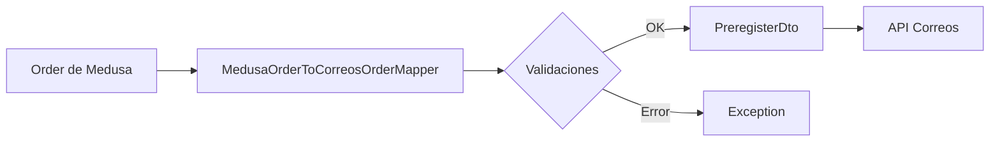

# Integración con Correos - Mapper y API

Esta documentación describe la implementación del mapper que transforma pedidos de MedusaJS a la entidad de pre-registro de Correos y el endpoint API asociado.

## Estructura de Archivos

```
src/
├── types/correos/preregister/
│   └── preregister-dto.ts          # Interfaces TypeScript para la entidad de Correos
├── constants/
│   └── correos-constants.ts        # Constantes estáticas para la integración
├── services/mappers/
│   └── medusa-order-to-correos-order.ts  # Clase mapper
└── api/admin/orders/[id]/preregister/
    └── route.ts                    # Endpoint API
```

## Variables de Entorno Requeridas

Configura las siguientes variables en tu archivo `.env`:

```bash
# Número de contrato con Correos
CORREOS_CONTRACT_NUMBER=54087707

# Número de cliente en Correos
CORREOS_CLIENT_NUMBER=9981516049

# Código de etiquetador
CORREOS_LABELLER_CODE=B6X6

# Código de producto (ej: PAFXB para Paquete Azul)
CORREOS_PRODUCT=PAFXB

# Método de entrega (ej: DOUAOF)
CORREOS_DELIVERY_METHOD=DOUAOF

# Provincia de admisión (código de 2 dígitos)
CORREOS_ADMISSION_PROVINCE=30
```

## Mapper: MedusaOrderToCorreosOrderMapper

### Uso Básico

```typescript
import { MedusaOrderToCorreosOrderMapper } from "../services/mappers/medusa-order-to-correos-order";

// Crear una instancia del mapper
const mapper = new MedusaOrderToCorreosOrderMapper();

// Recuperar un pedido con las relaciones necesarias
const order = await orderService.retrieve(orderId, {
  relations: ["items", "items.variant", "shipping_address"],
});

// Transformar el pedido
const correosOrder = mapper.transform(order);
```

### Mapeo de Datos

El mapper realiza los siguientes mapeos:

#### Items del Pedido → Datos Aduaneros

| Campo Medusa                    | Campo Correos                | Transformación       |
| ------------------------------- | ---------------------------- | -------------------- |
| `order.items[i].title`          | `customsData[i].description` | Directo              |
| `order.items[i].quantity`       | `customsData[i].quantity`    | toString()           |
| `order.items[i].unit_price`     | `customsData[i].netValue`    | Centavos → Euros     |
| `order.items[i].variant.weight` | `customsData[i].netWeight`   | Gramos (default: 10) |

#### Dirección de Envío → Destinatario

| Campo Medusa                                      | Campo Correos            | Notas               |
| ------------------------------------------------- | ------------------------ | ------------------- |
| `shipping_address.first_name`                     | `addressee.name`         |                     |
| `shipping_address.last_name`                      | `addressee.lastName1`    |                     |
| `shipping_address.address_1`                      | `addressee.address`      |                     |
| `shipping_address.city`                           | `addressee.locality`     |                     |
| `shipping_address.metadata.address_province_code` | `addressee.province`     | Código de 2 dígitos |
| `shipping_address.postal_code`                    | `addressee.cp`           |                     |
| `shipping_address.phone`                          | `addressee.contactPhone` |                     |
| `shipping_address.phone`                          | `addressee.smsNumber`    |                     |
| `order.email`                                     | `addressee.email`        |                     |

### Validaciones

El mapper valida:

1. **Variables de entorno**: Verifica que todas las variables requeridas estén configuradas
2. **Pedido completo**: El pedido debe tener dirección de envío e items
3. **Estructura de datos**: Valida que la estructura del pedido sea correcta

Si alguna validación falla, el mapper lanza un `Error` con un mensaje descriptivo.

## Endpoint API

### GET `/admin/orders/:id/preregister`

Transforma un pedido específico al formato de pre-registro de Correos.

#### Parámetros

- `id` (path): ID del pedido a transformar

#### Respuesta Exitosa (200)

```json
{
  "errorCodeLanguage": "spa",
  "shipments": [
    {
      "admissionProvince": "30",
      "packagesNumber": "1",
      "product": "PAFXB",
      "deliveryMethod": "DOUAOF",
      "contractNumber": "54087707",
      "clientNumber": "9981516049",
      "labellerCode": "B6X6",
      "totalWeight": "50",
      "modificationType": "1",
      "packages": [...],
      "addressee": {...},
      "sender": {...}
    }
  ]
}
```

#### Errores

**404 Not Found**

```json
{
  "message": "Order with id order_123 not found"
}
```

**500 Internal Server Error**

```json
{
  "message": "Failed to transform order to Correos preregister",
  "error": "Missing required environment variables: CORREOS_CONTRACT_NUMBER"
}
```

#### Ejemplo de Uso

```bash
# Autenticación con token de admin
curl -X GET \
  'http://localhost:9000/admin/orders/order_01H1VT5VXKQY7W8D6BQZPJ7J7E/preregister' \
  -H 'Authorization: Bearer {admin_token}' \
  -H 'Content-Type: application/json'
```

## Constantes Estáticas

Las siguientes constantes están definidas en `correos-constants.ts`:

### Configuración de Envío

- `ERROR_CODE_LANGUAGE`: "spa"
- `PACKAGES_NUMBER`: "1"
- `MODIFICATION_TYPE`: "1" (Alta)

### Configuración de Paquete

- `DEFAULT_HEIGHT`: "150" mm
- `DEFAULT_WIDTH`: "100" mm
- `DEFAULT_LENGTH`: "100" mm

### Configuración de Contenido

- `SHIPMENT_TYPE`: "2" (Mercancías)
- `INSTRUCTIONS_DO_NOT_DELIVER`: "D" (Devolver)

### Datos Aduaneros

- `COUNTRY_ORIGIN`: "ESP"

### Destinatario

- `COUNTRY`: "ESP"
- `LANGUAGE`: "spa"

### Remitente (Accesorios Cartago SLU)

- Todos los datos del remitente están predefinidos
- Ver `correos-constants.ts` para detalles completos

## Valores Vacíos

Los siguientes campos se instancian con cadenas vacías (`""`) directamente en el mapper:

- Campos de referencia del envío (`shipmentReference1`, `shipmentReference2`, `shipmentReference3`)
- Dimensiones no utilizadas (`totalLength`, `totalWidth`, `totalHigh`, `totalCubicMeters`)
- Referencias del cliente en paquetes
- Campos opcionales de dirección del destinatario (número, portal, bloque, etc.)
- Campos aduaneros opcionales

## Flujo de Datos



## Consideraciones

1. **Peso por defecto**: Si un item no tiene peso definido, se usa 10 gramos
2. **Conversión de moneda**: Los precios se convierten de centavos a euros
3. **Código de provincia**: Debe estar en los metadatos de la dirección como `address_province_code`
4. **Relaciones requeridas**: El pedido debe recuperarse con las relaciones: `items`, `items.variant`, `shipping_address`

## Testing

Para probar el mapper:

```typescript
import { MedusaOrderToCorreosOrderMapper } from "./medusa-order-to-correos-order";

describe("MedusaOrderToCorreosOrderMapper", () => {
  it("should transform a valid order", () => {
    const mapper = new MedusaOrderToCorreosOrderMapper();
    const order = {
      // ... orden de prueba
    };

    const result = mapper.transform(order);

    expect(result.shipments).toHaveLength(1);
    expect(result.errorCodeLanguage).toBe("spa");
  });
});
```

## Soporte

Para problemas o preguntas sobre la integración con Correos:

- Email: contacto@cartago4x4.es
- Documentación API Correos: [Enlace pendiente]
